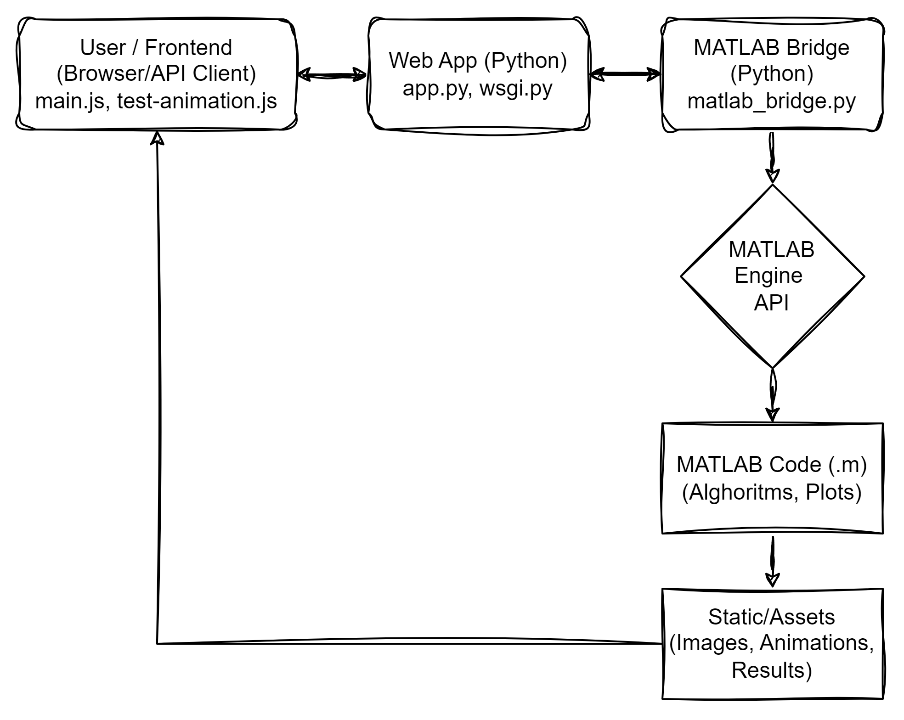

# Hands-on MATLAB with Python Integration

[](https://www.canva.com/design/DAGoNlMkQSk/g2kKVYQdcJf3D2zdqYUkXg/edit?utm_content=DAGoNlMkQSk&utm_campaign=designshare&utm_medium=link2&utm_source=sharebutton)

## Table of Contents
- [Introduction](#introduction)
- [Background](#background)
- [Motivation & Objectives](#motivation--objectives)
- [Project Architecture](#project-architecture)
- [Features](#features)
- [Project Structure](#project-structure)
- [Getting Started](#getting-started)
- [Usage](#usage)
- [How It Works](#how-it-works)
- [Example Topics](#example-topics)
- [Troubleshooting & Tips](#troubleshooting--tips)
- [Learning Resources](#learning-resources)
- [Contributing](#contributing)
- [License](#license)

## Introduction
This project demonstrates how to bridge MATLAB and Python, empowering engineers, researchers, and students to combine the strengths of both platforms. It provides practical scripts, a web-based interface, and a set of exercises to make MATLAB-Python interoperability accessible and hands-on.

## Background
MATLAB is a powerful environment for numerical computing, simulation, and visualization, widely used in engineering and science. Python has become the language of choice for data science, machine learning, and rapid prototyping due to its open ecosystem and extensive libraries. Many organizations and researchers need to use both environments together, but integration can be challenging due to differences in language, data types, and workflows.

## Motivation & Objectives
- **Motivation:** MATLAB is widely used for engineering and scientific computing, while Python is popular for data science, machine learning, and rapid prototyping. Integrating them allows users to leverage the best tools from both worlds.
- **Objectives:**
  - Enable calling MATLAB code from Python applications (not the other way around)
  - Provide a web interface for remote MATLAB execution
  - Offer clear, practical examples and exercises
  - Make integration easy for both MATLAB and Python users

## Project Architecture



**Description:**
- The architecture centers on executing MATLAB code from Python, both via scripts and a web interface.
- The webapp (Flask) acts as a bridge, accepting user input and triggering MATLAB computations.
- Communication is handled through the MATLAB Engine API for Python and file-based data exchange when needed.

## Features
- **Python → MATLAB integration:** Run MATLAB code from Python scripts and web applications
- **Web-based interface:** Use a Flask app to interact with MATLAB remotely
- **Data exchange:** Seamlessly pass data between Python and MATLAB using supported types
- **Real-world examples:** Scripts for plotting, data analysis, and more
- **Interactive exercises:** Practice and learn integration techniques
- **Presentation materials:** Slides and architecture diagrams included

## Project Structure
- `Examples/`
  - `matlab/`: MATLAB scripts for demonstration
  - `python/`: Python scripts for MATLAB integration
- `Exercise/`: Hands-on exercises
- `webapp/`: Flask web application for remote MATLAB interaction
- `presentation_slides/`: Slides and diagrams

## Getting Started
### Prerequisites
- MATLAB R2014b or later (R2019b+ recommended)
- Python 3.7+ (ensure accessible from MATLAB if needed)
- (Optional) Anaconda for environment management
- Flask and required Python packages

### Installation
1. Clone this repository:
   ```sh
   git clone https://github.com/luciry/Hands-on-MATLAB-with-Python.git
   cd Hands-on-MATLAB-with-Python
   ```
2. Install Python dependencies:
   ```sh
   pip install -r requirements.txt
   ```
3. (Optional) Set up MATLAB to use your Python:
   ```matlab
   pyenv('Version', 'C:/Path/To/python.exe')
   ```

## Usage
### 1. Run Python scripts that use MATLAB
- Go to `Examples/python/` and run the scripts. These will launch MATLAB Engine and execute MATLAB code from Python.

### 2. Use the Web Application
- Start the webapp:
  ```sh
  python wsgi.py
  ```
- Open your browser at [http://localhost:5000](http://localhost:5000) and interact with MATLAB via the web interface.

### 3. Try the Exercises
- Explore the `Exercise/` folder for hands-on practice in integrating Python and MATLAB.

## How It Works
- **MATLAB Engine API for Python:** The Python scripts and webapp use the official MATLAB Engine API to launch and control MATLAB sessions from Python. This allows you to execute MATLAB functions, scripts, and exchange variables directly from Python code.
- **Data Exchange:** Data is passed between Python and MATLAB using native types where possible (e.g., NumPy arrays ↔ MATLAB arrays). For unsupported types, file-based exchange (e.g., .mat, .csv, .png) is used.
- **Web Application:** The Flask webapp provides a user-friendly interface for sending commands and data to MATLAB, and for displaying MATLAB-generated results (such as plots) in the browser.

## Example Topics
- Calling MATLAB functions from Python
- Creating and displaying MATLAB plots via Python
- Exchanging data (arrays, scalars, images) between Python and MATLAB
- Automating MATLAB workflows from Python scripts or web requests
- Real-world use cases in engineering and data science

## Troubleshooting & Tips
- Ensure your MATLAB and Python installations are compatible (see MathWorks documentation for supported versions).
- If you encounter `EngineError` or cannot start MATLAB from Python, check your environment variables and Python version.
- Use `pyenv` in MATLAB to verify which Python interpreter is being used.
- When exchanging complex data, prefer using `.mat` files or structured data formats.
- For webapp issues, check that all dependencies are installed and that MATLAB is accessible from the server environment.

## Learning Resources
- **Presentation Slides:** See `presentation_slides/` for detailed explanations, diagrams, and step-by-step guides
- **Full Presentation:** [Canva Presentation](https://www.canva.com/design/DAGoNlMkQSk/g2kKVYQdcJf3D2zdqYUkXg/edit?utm_content=DAGoNlMkQSk&utm_campaign=designshare&utm_medium=link2&utm_source=sharebutton)
- **MATLAB Engine API for Python:** [Official Documentation](https://www.mathworks.com/help/matlab/matlab_external/get-started-with-matlab-engine-for-python.html)

## Contributing
Contributions are welcome! Please open an issue or submit a pull request with improvements, bug fixes, or new examples. For major changes, please discuss them first.

## Author
**Luca Cirillo**  
PhD Student in Simulation and AI at the University of Genova  
MATLAB Ambassador (at UniGE)  
Email: [lucacirillo@outlook.com](mailto:lucacirillo@outlook.com)

## License
This project is provided for educational purposes. See `LICENSE` file for details (to be added).

---

For more details, see the example scripts in each folder, the webapp documentation, and the presentation slides.

